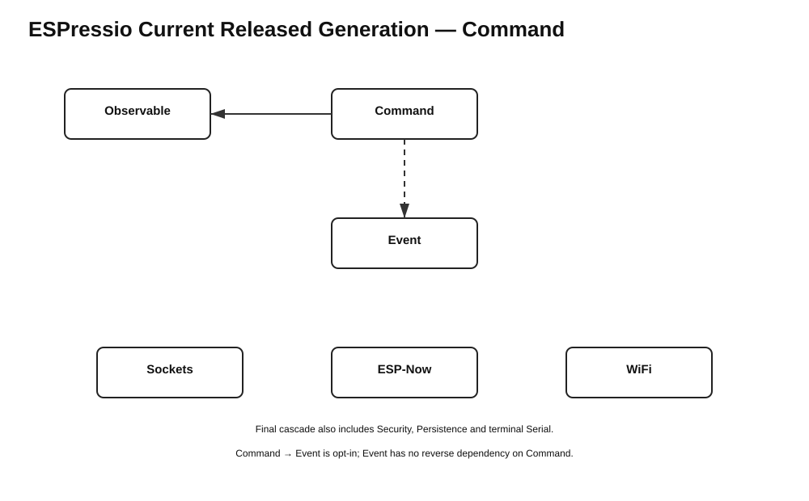

# ESPressio Dependency Chart — Command 0.4.0



## Command 0.4.0

```text
Command 0.4.0
    -> Observable >= 3.0.1 < 4.0.0
    - - -> Event >= 6.0.0 < 7.0.0
            Command Event types / CommandRegistryEventBridge only
```

The Event relationship is opt-in. Normal Command use remains Event-free.

## Final coordinated ecosystem

```text
Observable 3.0.1
Serializable 0.10.2
Units 0.2.3
Timing 2.2.4
Threads 3.1.4
Command 0.4.0
Security 0.3.0
Event 6.0.0
Sockets 0.6.0
ESP-Now 0.6.0
Serial 0.6.0
```

Command owns its Command-specific Event bridge. Event 6.0.0 does not depend back on Command, so no reciprocal edge remains.
