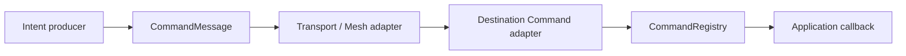

# Asynchronous Command Routing

A Command is asynchronous **intent**, not an RPC request.

Command therefore defines no intrinsic response expectation, completion response, reply route, pending-request table or timeout contract. A transport or higher-level integration may carry a `CommandMessage`, but transport delivery and requested-operation completion remain separate concerns.

## Conceptual flow

The `CommandMessage` preserves conceptual message identity, protocol version, optional correlation and bounded Command-family payload. It does not contain a transport destination, reply route, response mode or timeout.

## Delivery is not completion

A transport may independently confirm that the Command message was delivered. That confirmation says nothing about whether the requested application operation later completed.

Likewise, a local `CommandResult::Ok()` means the destination's local Command pipeline accepted/succeeded according to its parser/validation/dispatch/callback contract. It is not a distributed operation-completion response.

If an application needs to publish later progress, completion or resulting facts, it should do so with independent primitives such as Event or State, optionally using a `CorrelationId` to relate those messages to the originating Command.

## Responsibility boundary

Command owns intent semantics and local interpretation/dispatch. Mesh, Serial, HTTP, WebSocket and other transports own carriage. Any application workflow spanning multiple conceptual messages remains above Command rather than turning Command into RPC.
