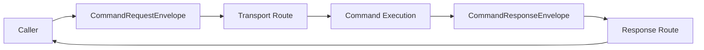

# Asynchronous Command Routing

The 1.0.0 baseline supports routed command requests that may cross an asynchronous transport while preserving request identity, origin, response expectations, and timeout policy.

## Flow

## Request identity

Each routed request uses a `CommandRequestId` so responses can be correlated even when multiple requests are outstanding concurrently.

## Origin

`CommandOrigin` identifies the transport route and optional origin address. A route ID of zero represents a local origin.

## Response semantics

A request explicitly states whether it expects no response, an acceptance acknowledgement, or completion, and whether the response mode is single or multiple.

## Why this belongs in Command

The semantic notion of a command request and its expected response belongs to the Command domain. The transport remains responsible for carrying bytes/messages and mapping its native addressing into the route/origin abstractions.

## Bounded operation

Outstanding routed requests are tracked with a fixed-capacity pool rather than an unbounded collection. See [Pending Request Management](Pending-Request-Management).