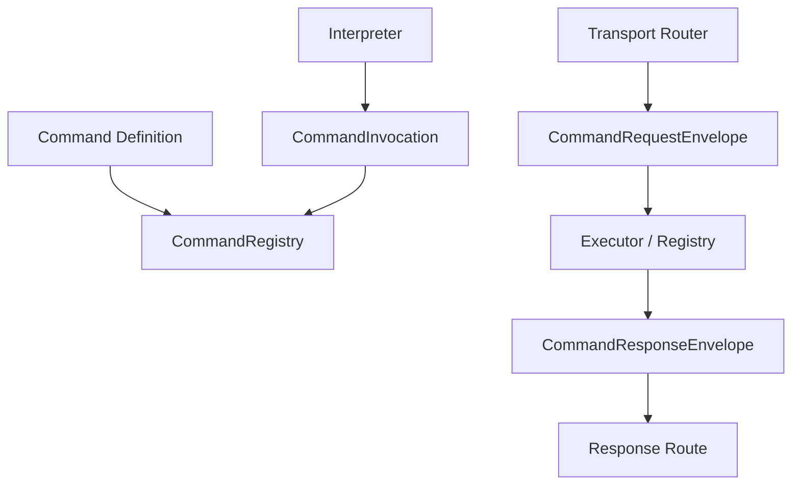

# Extension Architecture

Command extensions should preserve the separation between domain semantics, representation, execution, and transport routing.

## Boundaries

- Command definitions own path, metadata, parameters, validation and callbacks.
- Interpreters adapt a representation into `CommandInvocation`.
- Transport adapters map remote addressing/framing into Command request/response envelopes.
- Response routes return correlated responses without Command depending on the concrete transport.
- Optional Event integration observes/publishes lifecycle but is not required by the Command core.

## Extension rule

Add a new abstraction to Command only when it is meaningful across representations/transports. Protocol-specific framing, socket state, radio peer objects, HTTP request classes, or serial-port ownership belong outside this library.