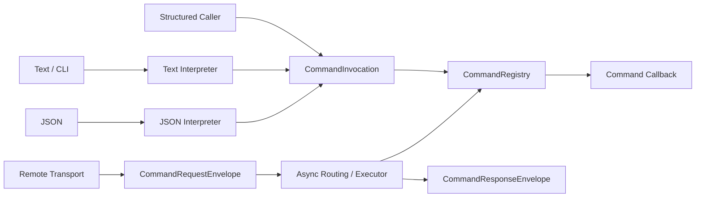

# ESPressio Command

> Documentation baseline: **1.0.0**

ESPressio Command provides transport-neutral, strongly typed Command definition, interpretation, routing, validation and invocation for the ESPressio Development Platform.

A Command expresses **intent**: something should be done. This is intentionally distinct from an Event, which expresses that something happened, and State, which represents currently available information.

## Architectural role

The transport and representation adapters are separate from the authoritative Command definition and registry.

## Choose your documentation path

### Using the library

- [Getting Started](Getting-Started)
- [Command Trees](Command-Trees)
- [Parameters and Validation](Parameters-and-Validation)
- [Command Values](Command-Values)
- [Structured Invocation](Structured-Invocation)
- [Text Commands](Text-Commands)
- [JSON Commands](JSON-Commands)
- [Results and Errors](Results-and-Errors)
- [Help Completion and Discovery](Help-Completion-and-Discovery)
- [Asynchronous Command Routing](Asynchronous-Command-Routing)
- [Request and Response Envelopes](Request-and-Response-Envelopes)
- [Response Expectations and Timeouts](Response-Expectations-and-Timeouts)

### Extending the library

- [Extension Architecture](Extension-Architecture)
- [Interpreter Integration](Interpreter-Integration)
- [Transport Integration](Transport-Integration)
- [Response Route Integration](Response-Route-Integration)
- [Pending Request Management](Pending-Request-Management)
- [Event Integration](Event-Integration)
- [Testing Command Extensions](Testing-Command-Extensions)

## Core principle

Application command callbacks should not know whether a request arrived over Serial, HTTP, WebSocket, ESP-NOW, another transport, or directly from a test. The Command definition is the contract; the transport is an adapter.