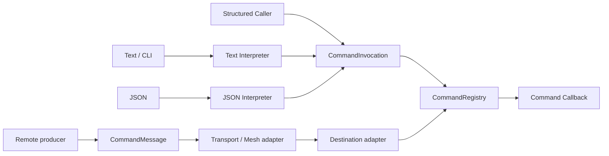

# ESPressio Command

> Documentation baseline: **1.0.0**

ESPressio Command provides transport-neutral, strongly typed Command definition, interpretation, validation and local invocation for the ESPressio Development Platform.

A Command expresses **asynchronous intent**: something should be done. This is intentionally distinct from Event, which expresses that something happened, and State, which represents authoritative/currently available information.

## Architectural role

`CommandMessage` carries conceptual identity, protocol version, optional correlation and bounded Command-family payload. It deliberately has no reply route, response expectation, completion response or timeout contract.

The transport and representation adapters remain separate from the authoritative Command definition and registry. Transport delivery acknowledgement, when provided, is not application-operation completion.

## Choose your documentation path

### Using the library

- [Getting Started](Getting-Started)
- [Command Trees](Command-Trees)
- [Parameters and Validation](Parameters-and-Validation)
- [Command Values](Command-Values)
- [Structured Invocation](Structured-Invocation)
- [Text Commands](Text-Commands)
- [JSON Commands](JSON-Commands)
- [Results and Errors](Results-and-Errors)
- [Help Completion and Discovery](Help-Completion-and-Discovery)
- [Asynchronous Command Routing](Asynchronous-Command-Routing)
- [Command Message Envelope](Request-and-Response-Envelopes)
- [Delivery, Completion and Timeouts](Response-Expectations-and-Timeouts)

### Extending the library

- [Extension Architecture](Extension-Architecture)
- [Interpreter Integration](Interpreter-Integration)
- [Transport Integration](Transport-Integration)
- [Transport Integration and Correlation](Response-Route-Integration)
- [Pending Command Work](Pending-Request-Management)
- [Event Integration](Event-Integration)
- [Testing Command Extensions](Testing-Command-Extensions)

## Core principle

Application Command callbacks should not know whether an intent arrived over Serial, HTTP, WebSocket, Mesh, another transport or directly from a test. Their returned `CommandResult` is a **local invocation disposition**, not a promise that the requested application operation has completed.

Applications needing later progress or completion information publish independent Event or State messages, optionally using `CorrelationId` to relate those messages to the originating Command.
